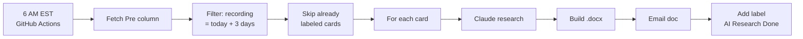
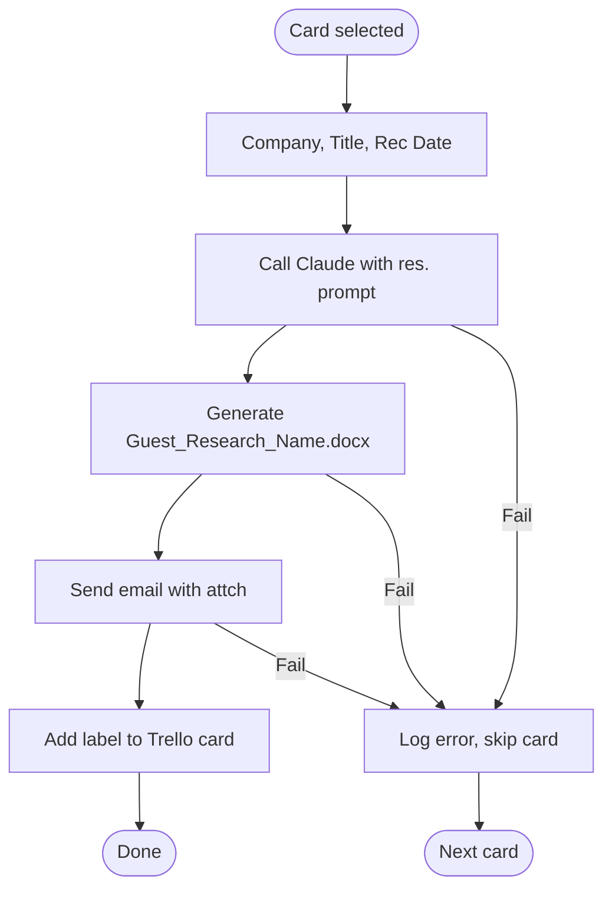
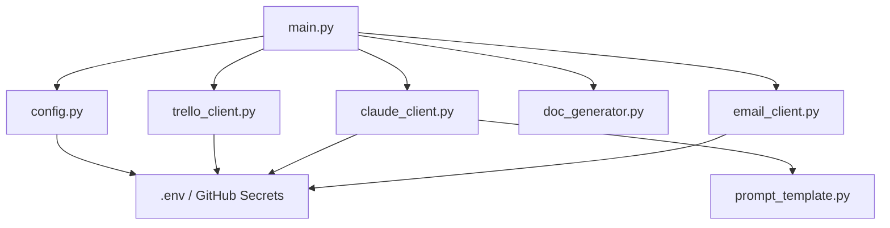

# The Dime Podcast — Research Automation

Automation that runs daily at **6 AM EST**, reads guest cards from Trello, generates AI research via Claude, builds a Word doc, emails it, and marks the card done.

---

## Flows

### Daily run (high-level)



### Per-card processing



### Code / config flow



---

## Trello card format (required)

Card must be in the **Pre** column. **Card title** = guest name.

**Description — first 3 lines exactly, then any links:**

```
Company: NEWTON
Title: Founder
Recording Date: 2026-02-09

https://www.linkedin.com/in/newton/
NEWTON | The Finest Cannabis Goods
```

| Line | Rule | Example |
|------|------|--------|
| 1 | `Company: ` + name | `Company: NEWTON` |
| 2 | `Title: ` + job title | `Title: Founder` |
| 3 | `Recording Date: ` + date | `Recording Date: 2026-02-09` or `2026-02-09 17:15` |
| 4+ | **Links and notes** (recommended) | LinkedIn, company site, articles, etc. — all are passed to Claude to improve research. More links = more useful output. |

Only cards whose **recording date is exactly 3 days from the run date** are processed. Cards with label **AI Research Completed** are skipped.

---

## Environment variables

Use these in `.env` locally or as **GitHub Secrets** for Actions.

| Variable | Required | Description |
|----------|----------|-------------|
| `TRELLO_API_KEY` | Yes | From https://trello.com/power-ups/admin → New → Key |
| `TRELLO_API_TOKEN` | Yes | From authorize URL with your key (read,write scope) |
| `TRELLO_BOARD_ID` | Yes | Board URL + `.json` → top-level `"id"` |
| `TRELLO_PRE_COLUMN_NAME` | No | Column to scan (default `Pre`) |
| `ANTHROPIC_API_KEY` | Yes | From https://console.anthropic.com/ |
| `EMAIL_HOST` | No | Default `smtp.gmail.com` |
| `EMAIL_PORT` | No | Default `587` |
| `EMAIL_USERNAME` | Yes | Gmail address |
| `EMAIL_PASSWORD` | Yes | Gmail app password (Security → App passwords) |
| `EMAIL_FROM` | Yes | Sender address |
| `EMAIL_TO` | No | Default `Bryan.Fields@8threv.com` |
| `TIMEZONE` | No | Default `UTC` (dates compared in UTC) |

---

## Setup (credentials)

1. **Trello:** Power-Ups admin → New → copy Key. Token:  
   `https://trello.com/1/authorize?expiration=never&scope=read,write&response_type=token&name=Dime%20Podcast&key=YOUR_API_KEY`  
   Board ID: open board → URL + `.json` → copy `"id"`.
2. **Anthropic:** console.anthropic.com → API Keys → create key.
3. **Gmail:** Google Account → Security → 2-Step Verification → App passwords → create for Mail.

---

## Local run

```bash
cd The-Dime-Podcast-
cp .env.example .env
# Edit .env with your values (quote any value with spaces or parentheses)

python3 -m venv venv
source venv/bin/activate   # Windows: venv\Scripts\activate
pip install -r requirements.txt

# Load env (use the method that works with your .env; if export fails, use set -a; source .env; set +a or similar)
export $(grep -v '^#' .env | xargs)

python test_local.py   # Validate config + Trello + Claude + SMTP
python main.py         # Run automation
```

---

## Deploy (GitHub Actions)

1. **Secrets:** Repo → Settings → Secrets and variables → Actions → New repository secret. Add each variable from the table above (same names).
2. **Push** your code to the repo.
3. **Actions:** Open Actions tab → enable workflows if prompted.
4. **Schedule:** Workflow runs daily at **6:00 AM EST** (cron `0 11 * * *` in `.github/workflows/daily.yml`). To change time, edit the cron (UTC: 6 AM EST = 11 UTC).
5. **Manual run:** Actions → “Daily Guest Research Automation” → Run workflow.

---

## Project structure

```
.
├── main.py              # Entry point, orchestration
├── config.py            # Env vars, validation
├── trello_client.py     # Trello API, card parse, labels
├── claude_client.py     # Anthropic Claude, research generation
├── doc_generator.py     # Word .docx from research text
├── email_client.py      # Gmail SMTP, send with attachment
├── prompt_template.py   # Research prompt for Claude
├── test_local.py        # Check config + Trello + Claude + email
├── requirements.txt
├── .env.example
├── .gitignore
└── .github/workflows/daily.yml   # 6 AM EST daily + workflow_dispatch
```

---

## What the research doc contains

- Header: **Name | Title | Company**
- Opening questions (5), Section 1 (beliefs / misunderstandings), Section 2 (background), Contrarian beliefs, SEO keywords.  
Generated by Claude from the prompt in `prompt_template.py`.

---

## Troubleshooting

| Problem | Fix |
|--------|-----|
| No cards processed | Recording date must be exactly 3 days from run date; card in Pre; no “AI Research Completed” label yet. |
| `export: not valid in this context` | Value in `.env` has unquoted `()` or spaces. Wrap that value in double quotes in `.env`. |
| SMTP auth failed | Use Gmail app password, 2FA on. |
| Trello error | Check key, token (read+write), board ID. |
| Claude error | Valid key, usage limits, key starts with `sk-ant-`. |
| Missing env vars | Same names in GitHub Secrets (case-sensitive). |

---

## Security

- No secrets in code. All from `.env` or GitHub Secrets.
- `.gitignore` includes `.env`.

---

*The Dime Podcast — proprietary.*
